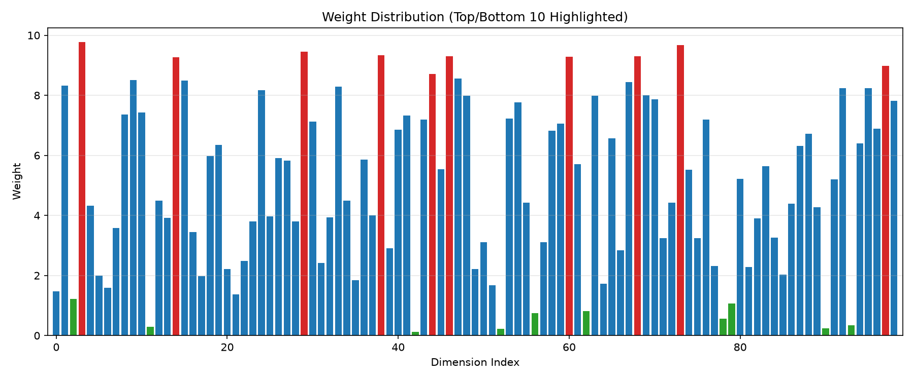
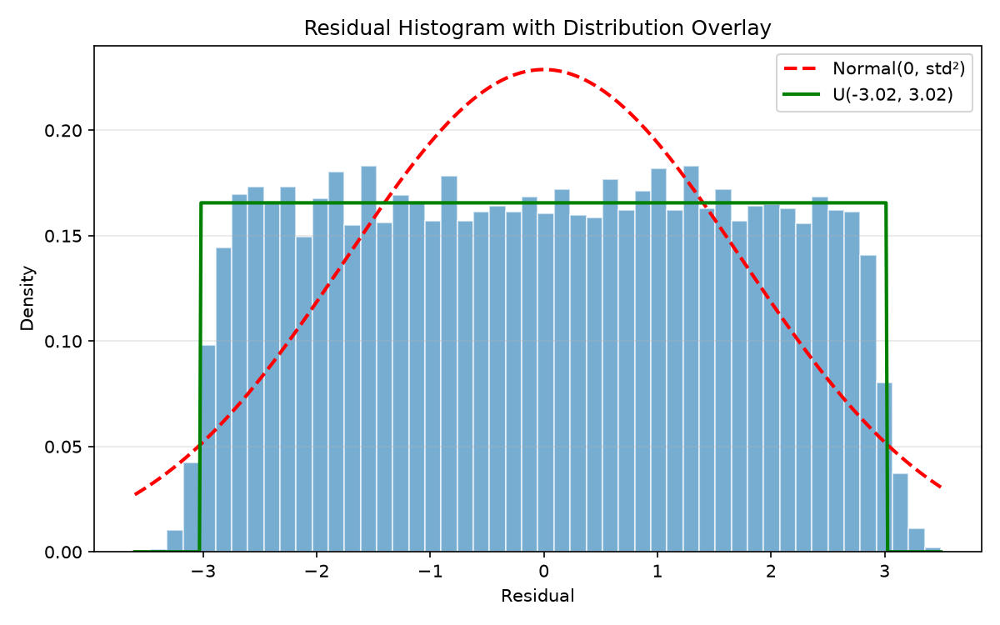
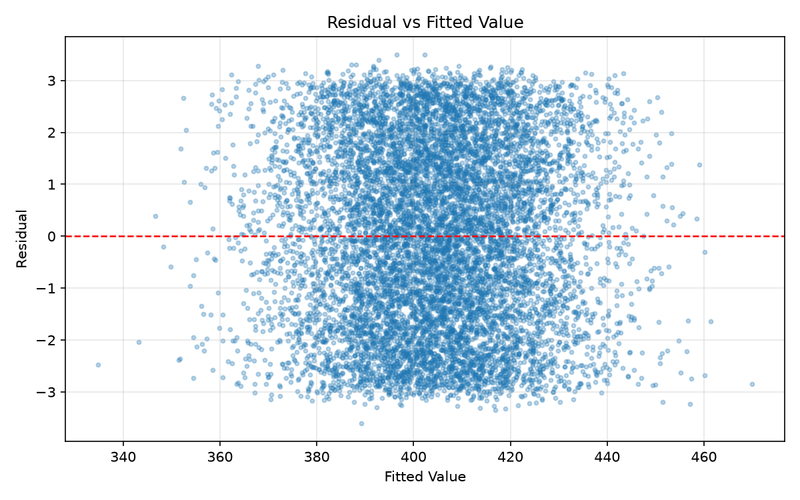

# Problem 1: Linear Transformation from A to B

## 摘要

建立线性模型 B = Aw + b·1 + ε，通过最小二乘法（SVD）求解闭式解。
模型拟合优度 R² = 0.9891，调整 R² = 0.9890，RMSE = 1.7434。
残差分析显示噪声近似为 U(-3.02, 3.02) 的对称有界轻尾噪声。

## 拟合结果

| 指标 | 数值 |
| --- | --- |
| R² | 0.9891 |
| Adjusted R² | 0.9890 |
| RMSE | 1.7434 |
| MAE | 1.5087 |
| MSE (噪声方差估计) | 3.0395 |
| 偏置 b | 151.6440 |
| 权重均值 | 5.1024 |
| 权重标准差 | 2.8253 |
| 权重最小值 | 0.1285 |
| 权重最大值 | 9.7661 |

## 残差诊断

| 检验项 | 统计量 | p 值 / 备注 |
| --- | --- | --- |
| Durbin-Watson | 1.9908 | ≈2 无自相关 |
| 残差-拟合值相关性 | -2.3666e-14 | OLS 理论 ≈0 |
| 偏度 | 0.0010 | ≈0 对称 |
| 超额峰度 | -1.1803 | 正态 0，均匀 -1.2 |
| Jarque-Bera | 580.4588 | 0.0000e+00 |
| Breusch-Pagan LM | 130.5120 | 0.0186 |
| KS 对均匀分布 | 0.0100 | 0.2682 |
| 卡方拟合优度（均匀） | 21.7546 | df=9 |
| 噪声半宽估计 | 3.0197 | U(-a, a) |
| 越界比例 | 0.0188 | outside (-a, a) |

## 误差分解

B 的总方差 ≈ 279.5421。
线性模型解释方差比例 ≈ 98.9127%，剩余不可约噪声方差 ≈ 3.0395（约 1.09%）。
加入二次项的对照实验显示模型偏差可忽略，误差主要来源于数据噪声。

## Figure 1: Weight Distribution

## Figure 2: Residual Histogram

## Figure 3: Residual vs Fitted

